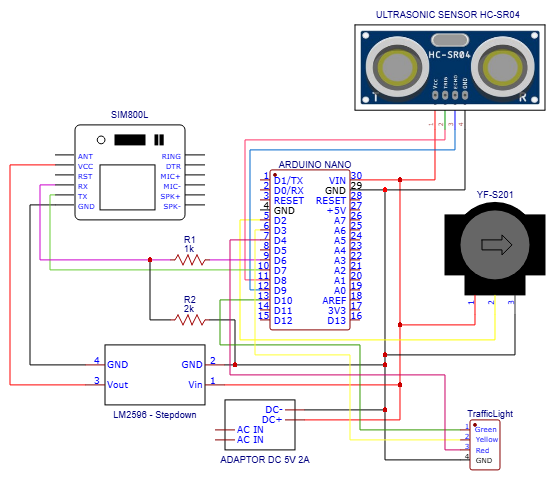
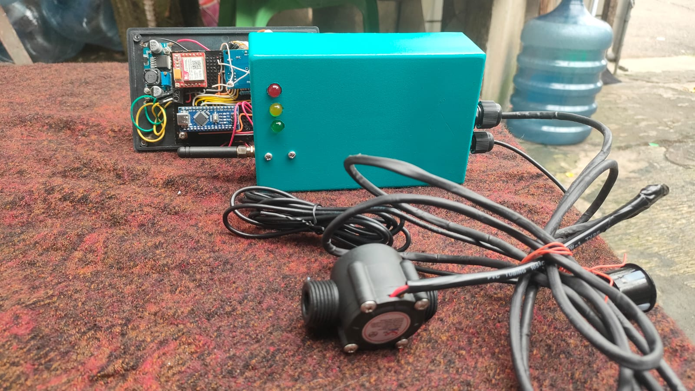

# 🌊 Flood Monitoring IoT System

IoT-based flood monitoring system for **real-time detection of water level and flow rate** using **JSN-SR04T ultrasonic sensor** and **YF-S201 flow sensor**. Data is transmitted via **SIM800L GSM module** with **MQTT protocol**, processed by **Arduino Nano**, and displayed on a **monitoring dashboard**.  

📍 Developed as part of the **Final Project / Undergraduate Thesis** at **Politeknik Negeri Jakarta** (2025).

---

## 📌 Background

Flood-prone areas often lack a **reliable early warning system**. This project aims to design an IoT-based monitoring solution that continuously measures **water level and flow rate** and provides **early alerts** for potential flooding.  

---

## 💡 Key Features

* 🌊 Real-time monitoring of water level (JSN-SR04T)  
* 💧 Flow rate measurement (YF-S201)  
* 📡 Data transmission using SIM800L (GSM 2G)  
* 🔔 LED-based early warning indicators (Safe / Alert / Danger)  
* 🌐 Web dashboard visualization via MQTT broker (HiveMQ)  

---

## 🧰 Hardware Components

* **Arduino Nano (ATmega328P)** – main controller  
* **JSN-SR04T Ultrasonic Sensor** – water level detection  
* **YF-S201 Flow Sensor** – water flow rate measurement  
* **SIM800L GSM Module** – MQTT data transmission  
* **LED Traffic Light Module** – early warning system  
* **Power Supply 5V / Step-down Converter**  
* **Project Box (IP-rated)** – outdoor protection  

---

## 🛠️ Technologies Used

* Arduino IDE (C++)  
* MQTT Protocol (HiveMQ broker hosted on AWS EC2)  
* Python (data logging & analysis)  
* Web Dashboard for visualization  

---

## 📂 Project Structure

```plaintext
flood-monitoring-iot/
├── src/              # Arduino source code
├── docs/             # Documentation (PDF, diagrams, images)
└── README.md         # Project documentation
```

---

## 🖼️ Schematic Diagram

The schematic below illustrates the connection between Arduino Nano, JSN-SR04T, YF-S201, SIM800L, and LED indicators.  



---

## 🔌 Pin Configuration Summary

### Arduino Nano

* **D2** → JSN-SR04T Trigger  
* **D3** → JSN-SR04T Echo  
* **D4** → YF-S201 Output  
* **D7, D8, D9** → LED Indicators (Green, Yellow, Red)  
* **D10 (TX) / D11 (RX)** → SIM800L UART  
* **5V / GND** → All modules  

---

## 📷 Prototype Device

Actual assembled prototype with sensor, GSM module, and LED indicators:  



---

## 🔁 System Workflow

1. **Arduino Nano** reads:  
   * Water level from JSN-SR04T  
   * Flow rate from YF-S201  
2. Data is sent to **SIM800L GSM module**  
3. **SIM800L** publishes data to MQTT broker  
4. Data is displayed on **web dashboard**  
5. LED indicator signals system status  

---

## 📊 Testing & Results

* ✅ **Availability:** 98.21%  
* ✅ **Durability:** 95.76%  
* ⏱ **Average Delay:** 1156.53 ms (due to GSM 2G)  
* 📅 Tested continuously for 7 days  

---

## 👨‍💻 Developer

**Natanael Siwalette**  
Multimedia and Network Engineering Student  
Politeknik Negeri Jakarta  
Focus Areas: IoT, Embedded Systems, Real-Time Monitoring  

---

## 📄 License

This project is licensed under the MIT License – see the [LICENSE](LICENSE) file for details.
